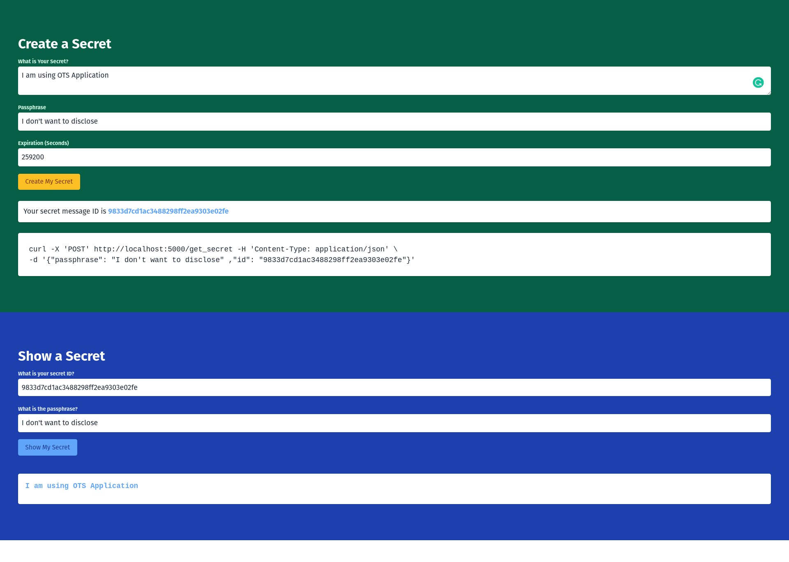

# OTS Application
One Time Secret Sharing Application Stack. 

It consists of 3 layers as other usual web-application does.

* Frontend Layer using ReactJs.
* Backend Layer using Python3 + FastAPI.
* Database Layer using Redis.



## Local Development Stack
```bash
docker-compose build

docker-compose up
```

### Local Urls
[Frontend UI](http://localhost:3000)

[Backend API](http://localhost:5000)

[Backend Swagger UI](http://localhost:5000/docs)

## Security Review
[security.md](./docs/security.md)

## Production Stack
### Public Docker Images
Images are published as part of github ci.

Ref: https://github.com/116davinder?tab=packages&repo_name=ots

#### Frontend Docker Images
* `ghcr.io/116davinder/ots_frontend:main` from main branch.
* `ghcr.io/116davinder/ots_frontend:pr-<pr-number>` from your PR.

#### Bakend Docker Images
* `ghcr.io/116davinder/ots_backend:main` from main branch.
* `ghcr.io/116davinder/ots_backend:pr-<pr-number>` from your PR.

We will be using `helm` to deploy the stack.
```bash

```