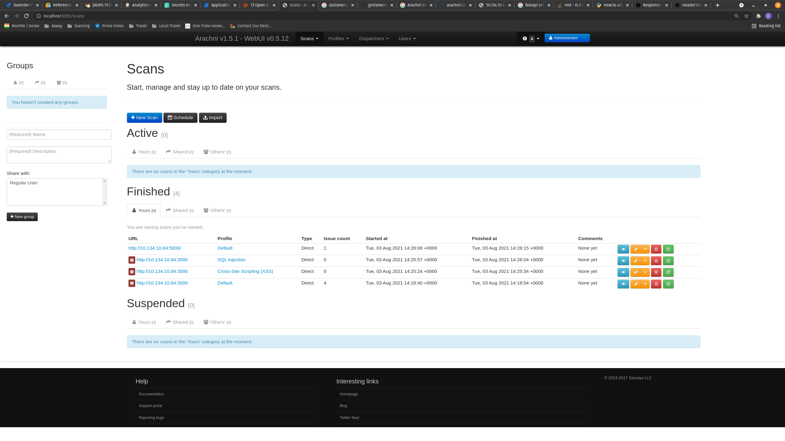
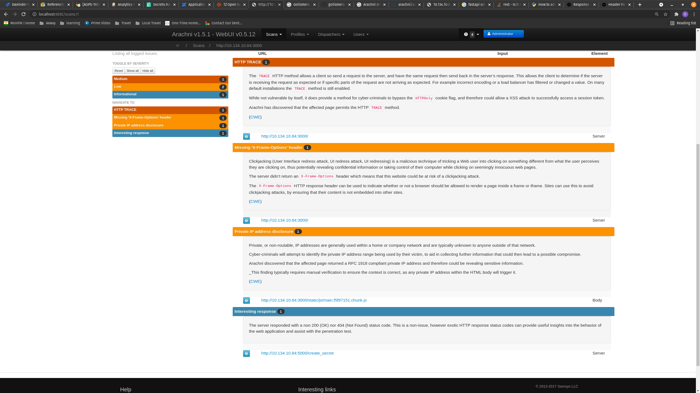

# How to do basic pentest OTS application

References:
1. https://hub.docker.com/r/arachni/arachni/

**Steps**
* start `docker-compose up`
* start `docker run --rm -p 222:22 -p 7331:7331 -p 9292:9292 --name arachni arachni/arachni:latest`
* access `http://localhost:9292` user: `admin@admin.admin` pass: `administrator`
* create new scan with `default` / `XSS` / `SQL Injection` and add backend/frontend address.

