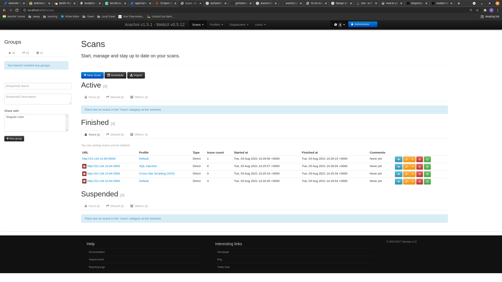

# Security Testing of OTS application

* **SAST**: [Using Github CodeQL Website](https://securitylab.github.com/tools/codeql/)

* **Container Scanning**: [Trivvy Website](https://aquasecurity.github.io/trivy/)

* **Web/API Testing**: [Arachni Website](https://www.arachni-scanner.com/)

**SAST Steps**
[CodeQL Code](../.github/workflows/codeql-analysis.yml)

**Container Scanning Steps**
[Trivvy Code](../.github/workflows/oci-image.yaml)

**Web/API Testing Steps**
* start `docker-compose up`
* start `docker run --rm -p 222:22 -p 7331:7331 -p 9292:9292 --name arachni arachni/arachni:latest`
* access `http://localhost:9292` user: `admin@admin.admin` pass: `administrator`
* create new scan with `default` / `XSS` / `SQL Injection` and add backend/frontend address.

* Some Screenshots

